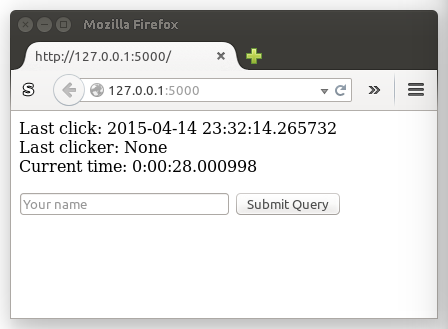

# thebutton

thebutton is a simple flask web site that allows users to click a button

## Interface

Last click: the time that the button was last clicked by another user

Last clicker: the name of the user that last clicked the button

Current time: time since the last click time
(refresh the page to update this time)

Your name: enter your name here before clicking the button

## Planned feature ideas

leaderboard: show the users that clicked the button ranked by the longest
time between when they clicked the button and when the previous user
clicked the button

error handling: check that users have reasonable, unique names

running current time: update the current time without refreshing

resetting current time: when another user clicks reset the current time,
last click and last clicker information displayed in other browser windows

clicker API: create a simple API for this application

fix bugs, make more awesome
